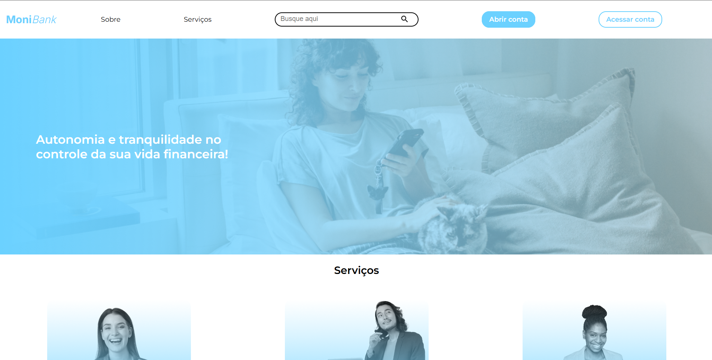

# 💰 Monibank – Seu Banco Digital Simulado

> **Monibank** é um projeto de site desenvolvido para estudos, simulando a interface e o funcionamento básico de um banco digital moderno.  
> O objetivo é aplicar conceitos de **HTML, CSS e JavaScript**, praticando **componentização, interatividade e organização de código.**

---

## 🧠 Sobre o Projeto

O **Monibank** foi desenvolvido com base em aulas práticas da **Alura Cursos Online**, onde o foco é criar uma **experiência interativa de login e navegação**, semelhante a uma aplicação bancária real.

Este projeto reforça habilidades como:
- Estruturação de páginas web com **HTML semântico**  
- Estilização com **CSS modular e responsivo**  
- Manipulação do DOM com **JavaScript**  
- **Validação de formulários**, controle de fluxos e eventos  
- Organização de código em múltiplos arquivos e pastas

---

## 🎨 Interface

> *(adicione aqui um print do site para o README ficar mais visual)*  

---

## 🛠️ Tecnologias Utilizadas

| 🚀 Tecnologia | 💡 Função |
|----------------|-----------|
| 🧩 **HTML5** | Estrutura das páginas |
| 🎨 **CSS3** | Estilização, layout e responsividade |
| ⚙️ **JavaScript (ES6+)** | Lógica e interatividade |

---

## 📂 Estrutura do Projeto

monibank/
├── img/ → Imagens e ícones
├── js/ → Scripts JavaScript
├── pages/ → Páginas adicionais (login, dashboard, etc.)
├── styles/ → Arquivos CSS
├── index.html → Página inicial do projeto
└── README.md → Documentação do projeto

💡 Aprendizados Principais

Criação de layouts modernos com CSS Grid e Flexbox

Implementação de validações simples em formulários

Manipulação de eventos e elementos DOM

Organização modular de código (HTML + JS + CSS)

Importância de boas práticas e semântica no front-end

🔮 Melhorias Futuras

🔐 Integração com API de autenticação real

💾 Armazenamento de dados no LocalStorage

📊 Simulação de extrato e movimentações financeiras

🌙 Adição de tema escuro

🧭 Dashboard interativo com gráficos

👨‍💻 Autor

Desenvolvido com 💜 por DevFbz

📧 Contato: brenofabrizio2018@gmail.com
